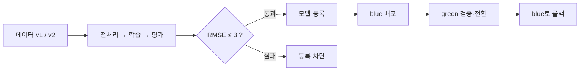

# Azure Machine Learning MLOps 실습

**데이터를 버전 관리하고, 모델을 학습·평가한 뒤, 좋은 모델만 배포하고 새 버전으로 교체했다가 되돌려 봅니다.**

Azure ML **Studio**에서 확인하고 **Compute**에서 실행하는 실습입니다. Python·ML 기초 지식이 있는 학습자를 대상으로 하며 약 100–150분이 필요합니다. 최초 환경 생성과 Azure 배포 대기는 별도입니다.

## 어디서 시작하나요?

| 상황 | 시작 문서 |
|---|---|
| 준비된 Azure 환경에서 실습 | **[Notebook 열기 — 권장](notebooks/01-studio-mlops.ipynb)** |
| 같은 실습을 터미널로 진행 | [Studio + CLI 단계별 가이드](docs/lab-guide.md) |
| 강사가 새 Azure 환경을 구성 | [환경 준비](docs/setup.md) |
| 실제 실행 결과와 Job 확인 | [검증 보고서](https://github.com/junwoojeong100/azure-ml-labs/blob/main/docs/execution-report.md) |
| 오류가 발생하거나 실습을 정리 | [문제 해결·비용 정리](docs/troubleshooting.md) |

**Notebook과 CLI 중 하나만 선택합니다.** 두 경로를 모두 실행할 필요는 없습니다. 네트워크·권한 구성은 강사용 환경 준비 문서에 분리했습니다.

## 준비된 환경에서 시작하기

1. [Azure ML Studio](https://ml.azure.com)에 로그인해 `mlw-mlops-managed-20260916`을 선택합니다.
2. **Compute → Compute instances → `ci-mlops-private` → Start**를 선택합니다.
3. **Notebooks**에서 전체 프로젝트 폴더의 `notebooks/01-studio-mlops.ipynb`를 엽니다.
4. 처음이라면 [kernel·로그인 준비](docs/setup.md#compute-instance에서-실행-준비)를 완료하고 **AML MLOps Lab (Python 3.12)** kernel을 선택합니다.
5. Notebook 셀을 순서대로 실행하며 아래 항목을 Studio에서 확인합니다.

개인 환경을 새로 만들었다면 이름은 `config.json`의 값을 사용합니다. Notebook 하나만 복사하지 말고 모듈·컴포넌트·설정을 포함한 프로젝트 전체를 배치합니다.

## 실습에서 확인할 7가지

| 단계 | 할 일 | 완료 기준 |
|---|---|---|
| 1 | 데이터·환경·컴포넌트 등록 | Data v1/v2와 고정된 환경·컴포넌트 버전 확인 |
| 2 | 파이프라인 학습 | `prepare_data → train_model → evaluate_gate` 완료 |
| 3 | 나쁜 모델 실행 | **의도된 Failed**, RMSE 초과, Registry 등록 차단 |
| 4 | 좋은 모델 등록·blue 배포 | 모델의 원본 Job 확인, 5행 요청에 숫자 5개 응답 |
| 5 | 데이터 v2로 재학습 | 같은 검증 데이터로 두 모델의 지표 비교 |
| 6 | green 전환·blue 롤백 | **기본 endpoint 경로**에서 새 모델과 이전 모델 각각 호출 |
| 7 | 비용 정리 | endpoint 삭제, Instance 중지, Cluster 실제 0노드 확인 |

**의도된 실패 셀이 있으므로 Notebook의 Run all을 사용하지 않습니다.** 일반 인증·네트워크 실패와 품질 게이트 실패를 구별합니다.

## 헷갈리기 쉬운 세 가지

| 항목 | 역할 |
|---|---|
| Compute Instance | Notebook 편집과 실행 제출 |
| Compute Cluster | 실제 전처리·학습·평가와 환경 이미지 빌드 |
| Online Endpoint의 VM | 학습과 별개로 실행되는 추론 서비스 |

평가 지표는 부모 Job이 아니라 **`evaluate_gate` 자식 Job의 Metrics**에 있습니다. `--deployment green` 직접 호출만으로 트래픽 전환이 검증되지는 않으므로, 전환 후 일반 호출도 수행합니다.

## 실습 범위와 비용

데이터는 개인정보가 없는 합성 회귀 데이터입니다. 품질 기준 **RMSE ≤ 3**은 이 데이터 전용이며, 운영 품질 기준이나 성능 SLA가 아닙니다. 데이터·환경 버전 관리, MLflow 추적, 품질 게이트, 수동 승격, 재학습, 전환·롤백을 다룹니다. GitHub CI 코드는 포함하지만 자동 CD·일정 재학습·데이터 drift 감시까지 구성한 것은 아닙니다.

**VM을 멈춰도 비용이 완전히 0이 되지는 않습니다.** Premium ACR의 East US 2 공개 표시 가격은 약 **USD 1.6666/일**이며 Private Endpoint·Storage·디스크 등은 별도입니다. 실습을 보관하지 않을 때는 [전용 RG 정리](docs/troubleshooting.md#전체-환경이-더-이상-필요하지-않은-경우)를 수행합니다.
