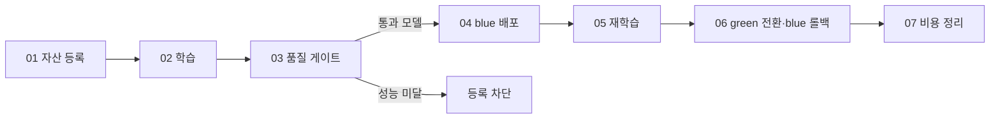

# Azure Machine Learning MLOps 실습

**데이터를 버전 관리하고, 좋은 모델만 배포한 뒤, 새 모델로 교체했다가 이전 모델로 되돌립니다.**

Python·ML 기초를 아는 학습자를 위한 **Studio + Compute 실습**입니다. 학습자 조작·학습 시간은 약 100–150분이며, 최초 환경 생성·패키지 설치·Azure 배포 대기는 별도입니다.

## 처음이라면 여기서 시작하세요

**[학습자 시작 안내 →](docs/learner-start.md)**

준비된 Workspace에서 **파일 준비 → kernel·로그인 확인 → Notebook 시작**까지 순서대로 따라갑니다. 학습자가 새 RG나 네트워크를 만들 필요는 없습니다.

진행 경로는 하나입니다: **시작 안내의 준비 A–E → `01-studio-mlops.ipynb` 안의 00–07**. Notebook 파일 8개가 아니라 **파일 하나의 단계 번호**입니다. Notebook과 CLI를 둘 다 실행하지 않습니다.

이미 시작한 실습을 이어간다면 새 ZIP을 풀거나 처음부터 실행하지 말고 **[기존 실행 이어가기](docs/troubleshooting.md#기존-실행을-이어가기)**로 이동합니다. 오류가 났거나 중간에 끝내려면 **[문제 해결·비용 정리](docs/troubleshooting.md)**를 엽니다.

## 무엇을 확인하면 끝인가요?

| 실습 | 완료 조건 |
|---|---|
| 01 자산 등록 | Data v1/v2와 고정된 환경·컴포넌트 버전 확인 |
| 02 학습 | `evaluate_gate`의 `approved=true`, **RMSE ≤ 3** |
| 03 품질 게이트 | 성능 미달 모델의 **의도된 Failed**와 Models 등록 차단 |
| 04 blue 배포 | 5행 요청 → 숫자 5개, 기본 endpoint도 blue를 사용 |
| 05 재학습 | 동일 검증 데이터로 v1/v2의 지표 비교, 새 모델 버전 등록 |
| 06 전환·롤백 | 기본 경로에서 **blue → green → blue** 응답 확인 |
| 07 비용 정리 | 본인 endpoint 삭제, Instance Stopped, 전용 Cluster 실제 0노드 |

**Run all을 사용하지 않습니다.** 03에는 의도적으로 실패하는 셀이 있습니다. 각 단계의 완료 조건을 확인한 뒤 다음으로 이동합니다. 실행 중 Job 화면은 **새 탭**으로 엽니다.

## 세 가지 Compute를 구분하세요

| 이름 | 역할 |
|---|---|
| Compute Instance | Notebook 편집·실행 제출용 VM |
| Compute Cluster | 실제 전처리·학습·평가와 환경 이미지 빌드 |
| Online Endpoint의 VM | API 요청을 처리하는 별도 추론 서버 |

Workspace는 실습 자산을 관리하는 작업 공간이며, **Models는 그 안의 모델 목록**입니다. MLflow는 매개변수·지표·모델 이력을 기록하고, RMSE는 **작을수록 좋은 예측 오차**입니다.

Endpoint는 예측 요청을 받는 주소, `blue`와 `green`은 그 뒤에서 요청을 처리하는 배포 이름입니다. **주소는 그대로 두고 요청을 받을 모델만 바꿉니다.**

VM 사양·확장 정책·비용과 Serverless/Kubernetes/Batch 대안은 **[학습·추론 인프라 안내](docs/infrastructure.md)**에서 확인합니다. 선택 읽기이며 필수 실습 단계는 늘어나지 않습니다.

## 필요한 문서만 열기

| 목적 | 문서 |
|---|---|
| 권장 실습 경로 | [학습자 시작 안내](docs/learner-start.md) → [Notebook](notebooks/01-studio-mlops.ipynb) |
| 학습·추론이 실행되는 위치와 다른 옵션 | [인프라 구성·선택 가이드](docs/infrastructure.md) |
| Notebook 대신 터미널로 실습 | [동일한 01–07 CLI 가이드](docs/lab-guide.md) |
| 강사가 새 Azure 환경을 구성 | [강사용 환경 준비](docs/setup.md) |
| 오류·중단·재개·정리 | [판단표](docs/learner-start.md#기다릴지-고칠지-판단하기) / [상세 문제 해결](docs/troubleshooting.md) |
| 과거 실제 Azure 실행 결과 | [검증 보고서](docs/execution-report.md) |
| 이 문서의 명확성 평가 | [평가 기준과 근거](docs/guide-quality.md) |

데이터는 개인정보 없는 합성 회귀 데이터이며 **RMSE ≤ 3은 이 실습 전용 기준**입니다. 자동 CD·예약 재학습·데이터 drift 감시·성능 SLA 검증은 범위 밖입니다.

**VM을 멈춰도 비용은 완전히 0이 되지 않습니다.** Premium ACR·Private Endpoint·Storage·디스크 등은 남습니다. 요금과 전체 환경 삭제 조건은 [전용 RG 정리](docs/troubleshooting.md#전체-환경이-더-이상-필요하지-않은-경우)에서 확인합니다.

공유 학습 Cluster는 다른 Job 때문에 0노드가 아닐 수 있습니다. 다른 사람의 Job을 취소하지 말고 [개인 종료 기준](docs/troubleshooting.md#공유-학습-클러스터의-정리)을 따릅니다.
