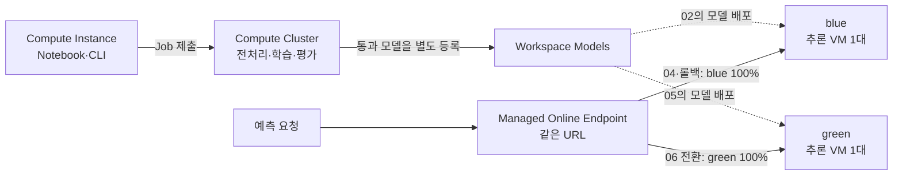

# 학습·추론 인프라와 다른 선택지

**학습은 Azure ML Compute Cluster, 실시간 추론은 Managed Online Endpoint에서 실행합니다. Notebook VM·학습 VM·추론 VM은 서로 별개이며, 이 실습은 GPU 없이 CPU만 사용합니다.**

이 페이지는 **선택 읽기**입니다. 인프라를 새로 만들거나 바꾸는 단계가 아닙니다. 실습은 그대로 [학습자 시작 안내](learner-start.md) → [Notebook 00–07](../notebooks/01-studio-mlops.ipynb) 순서로 진행합니다.

## 한눈에 보는 실행 위치

점선은 등록 모델의 배포, Endpoint에서 나가는 실선은 예측 요청 경로입니다. **blue와 green에 동시에 100%를 보내는 것이 아니라, 실습 단계에 따라 한쪽을 선택**합니다.

Endpoint는 요청을 받는 **주소**, deployment인 blue/green은 모델을 실행하는 **VM을 포함한 배포 단위**입니다. 학습 클러스터에 추론 서버를 함께 올리는 방식도, 사용자가 AKS를 직접 구성하는 방식도 아닙니다.

## 이 저장소의 기본 설정

아래는 **코드에 지정된 구성**이며 현재 실행 중인 VM 수를 조회한 결과는 아닙니다. 강사가 다른 이름을 지정했다면 본인의 `config.json`과 Studio를 기준으로 확인합니다.

| 역할 | Azure 리소스·기본 이름 | VM·확장 정책 | 수행하는 일 |
|---|---|---|---|
| Notebook·제출 | Compute Instance · `ci-mlops-private` | `Standard_DS3_v2` 1대, **30분** 유휴 시 종료 설정 | Notebook 편집·실행, CLI 로그인, Job 제출 |
| 학습·평가 | Compute Cluster (`AmlCompute`) · `cpu-private-only` | `Standard_DS3_v2`, **0–2노드**, **120초** 유휴 후 축소, `dedicated` | 전처리·학습·평가, 이 구성의 추론 환경 이미지 빌드 |
| 실시간 추론 | Managed Online Endpoint의 blue/green deployment | `Standard_DS3_v2`, **blue 1대 + green 1대**. green은 06에서 추가 | 등록한 MLflow 모델을 로드하고 HTTP 예측 요청 처리 |

`Standard_DS3_v2` 한 대의 사양은 **4 vCPU, RAM 14 GiB, GPU 없음**입니다. 0–2노드는 학습 클러스터의 확장 범위이지, 항상 2대를 사용하거나 한 학습을 2대로 분산한다는 뜻은 아닙니다. 현재 파이프라인에는 분산 학습 설정이 없습니다.

학습 노드는 Job 수요에 맞춰 늘고 줄지만, **추론은 배포당 1대로 고정**했습니다. 온라인 추론의 자동 확장 정책은 이번 실습에 구성하지 않았습니다.

| 설정을 확인할 곳 | 확인할 값 |
|---|---|
| [Compute Instance YAML](../infra/compute-instance.yml) | `size`, `idle_time_before_shutdown_minutes` |
| [Compute Cluster YAML](../infra/compute-cluster.yml) | `size`, `tier`, `min_instances`, `max_instances`, `idle_time_before_scale_down` |
| [설정 예제](../config.example.json) | `compute_instance`, `compute_cluster`, `deployment_instance_type` |
| [학습 파이프라인](../mlops_lab/pipeline.py) | `default_compute`가 학습 Cluster를 사용 |
| [배포 코드](../mlops_lab/operations.py) | `ManagedOnlineDeployment`의 `instance_type`, `instance_count=1` |
| [강사용 환경 준비](setup.md#4-네트워크-프로비저닝과-compute-생성) | 이미지 빌드 Compute를 학습 Cluster로 지정 |

## 비용과 정리에서 헷갈리지 않기

- **학습 노드 0개와 추론 트래픽 0%는 다릅니다.** 학습 클러스터는 유휴 시 0노드로 줄지만, 트래픽이 없는 온라인 배포도 VM을 유지하므로 비용이 발생합니다.
- **blue/green을 함께 유지하는 구간에는 기본적으로 추론 VM 2대**가 필요합니다. green으로 전환했다고 blue VM이 삭제되거나 중지되지 않습니다. 07의 endpoint 삭제가 두 배포를 함께 정리합니다.
- **Compute Instance 중지는 전체 실습 종료가 아닙니다.** 실행 중 Job과 endpoint는 별도로 처리하고, Premium ACR·Private Endpoint·Storage·디스크의 잔존 비용도 고려합니다.

전용 환경에서는 endpoint 없음 / Instance Stopped / Cluster 실제 0노드를 확인합니다. 공유 Cluster를 사용한다면 [공유 학습 클러스터의 개인 종료 기준](troubleshooting.md#공유-학습-클러스터의-정리)을 따르며, 다른 학습자의 Job을 취소하지 않습니다. 전체 환경을 보관하지 않을 때의 삭제 조건은 [전체 RG 정리](troubleshooting.md#전체-환경이-더-이상-필요하지-않은-경우)에 있습니다.

## 네트워크는 어떻게 구성했나요?

[Workspace 설정](../infra/workspace.yml)은 managed network의 **`allow_internet_outbound`** 모드입니다. Compute Instance와 Cluster는 노드의 공인 IP와 공개 SSH를 사용하지 않고, Storage는 keyless 인증과 private 접근 경로를 사용합니다. 추론 요청 인증은 **Microsoft Entra ID (`aad_token`)**입니다.

**Managed network라고 해서 인터넷 통신이 모두 차단되거나 추론 URL이 자동으로 private 전용이 되는 것은 아닙니다.** 이 모드는 outbound 인터넷 통신을 허용하며, 추론의 inbound 공개 범위와 인증은 별도로 봐야 합니다. 세부 생성·권한 설정은 학습자 준비가 아니라 [강사용 환경 준비](setup.md)의 범위입니다.

## 다른 학습 옵션

| 옵션 | 적합한 상황 | 현재 구성과의 차이 |
|---|---|---|
| **Compute Cluster — 현재 사용** | 반복 학습·평가, VM 종류와 최소/최대 노드를 명시하고 싶을 때 | 클러스터를 미리 만들고 이름으로 Job 제출. Azure ML이 노드 수명 주기를 관리 |
| **[Serverless Compute][serverless]** | 클러스터 사전 생성과 관리를 줄이고 싶을 때 | Job에 필요한 자원을 지정하면 Azure ML이 컴퓨트를 생성·관리. **무료가 아니며 Azure ML Compute 쿼터와 VM 사용 비용은 필요** |
| **Compute Instance / 로컬 PC** | 작은 모델의 빠른 실험·디버깅 | Notebook에서 직접 학습 가능. 이 실습처럼 개발 VM과 학습 Job을 별도 인프라로 분리하는 구성은 아님 |
| **[Kubernetes Compute][kubernetes]** | 기존 AKS, 온프레미스·멀티클라우드의 Arc 연결 Kubernetes를 활용할 때 | 운영팀이 클러스터·네트워크·Azure ML 확장 설치를 관리. Azure ML의 Kubernetes 학습은 노드 자동 확장을 지원하지 않음 |

## 다른 추론 옵션

| 옵션 | 적합한 상황 | 운영·비용 관점 |
|---|---|---|
| **Managed Online Endpoint — 현재 사용** | 즉시 응답하는 API, blue/green 전환, 추론 인프라 관리 최소화 | CPU/GPU VM 선택과 자동 확장 정책 구성 가능. **0노드 축소는 지원하지 않으며** 실행 중 배포 VM에 비용 발생 |
| **[Kubernetes Online Endpoint][kubernetes]** | 기존 Kubernetes나 온프레미스에서 실시간 추론이 필요할 때 | AKS/Arc 클러스터를 재사용할 수 있지만 클러스터·네트워크 운영 책임은 더 큼. CLI/SDK v2의 Kubernetes 방식 사용 |
| **[Batch Endpoint][batch]** | 대량 파일·데이터셋의 주기적 예측, 즉시 응답이 불필요할 때 | 호출하면 비동기 Job으로 처리하고 결과를 Storage에 저장. Azure ML Compute Cluster를 최소 0노드로 구성하면 유휴 시 0노드로 축소 가능 |

여기서 **학습용 Serverless Compute는 온라인 추론 endpoint를 대체하는 기능이 아닙니다.** 학습 실행 위치와 추론 제공 방식은 각각 선택합니다. 온라인/배치의 비용·확장 차이는 [공식 endpoint 비교][endpoints]에서 확인할 수 있습니다.

## VM 종류를 바꾸거나 다른 옵션으로 전환하려면

**CPU/GPU 선택은 Compute 방식과 별도의 결정**입니다. GPU를 사용하는 딥러닝 모델이라면 지원되는 GPU SKU와 학습·추론 환경을 함께 선택합니다. 현재 실습의 작은 Ridge 회귀 모델에는 CPU로 충분합니다.

`DS3_v2`는 [이전 세대 VM][vm-size]입니다. 실습에서 검증한 설정이지 신규 운영 환경의 권장 SKU를 뜻하지는 않습니다. 새 환경은 Azure ML 지원 SKU, 리전·쿼터·가격에 맞춰 선정합니다.

**이 페이지는 대안 비교이며 전환 절차가 아닙니다.** 다른 옵션을 쓰려면 Compute 이름만 바꾸지 말고 Job 대상, 이미지 빌드, 네트워크·권한, 배포와 정리 절차를 함께 조정해야 합니다. 이번 실습을 따라가는 학습자는 기본 구성을 유지합니다. 대안 구성을 이 저장소에서 실제 실행·검증한 것으로 해석하지 않습니다.

공식 문서 확인: **2026-09-17**.

[serverless]: https://learn.microsoft.com/azure/machine-learning/how-to-use-serverless-compute?view=azureml-api-2
[kubernetes]: https://learn.microsoft.com/azure/machine-learning/how-to-attach-kubernetes-anywhere?view=azureml-api-2
[batch]: https://learn.microsoft.com/azure/machine-learning/concept-endpoints-batch?view=azureml-api-2
[endpoints]: https://learn.microsoft.com/azure/machine-learning/concept-endpoints?view=azureml-api-2
[vm-size]: https://learn.microsoft.com/azure/virtual-machines/sizes/general-purpose/dsv2-series
