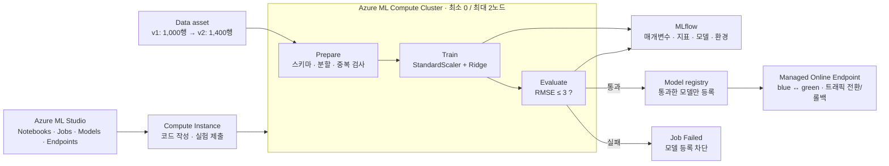

# 실습 가이드: Studio 확인 + CLI 실행

**모델을 한 번 학습하는 데서 끝내지 않고, 같은 과정을 재현하고, 품질이 낮은 모델을 차단하고, 새 모델로 교체했다가 되돌리는 실습입니다.**

대상은 Python·ML 기초를 아는 개발자/데이터 분석가입니다. 진행 시간은 약 100–150분이며, 최초 리소스 생성·이미지 다운로드·배포 대기는 별도입니다. **Azure CLI v2와 Python SDK v2만 사용**합니다.

**처음에는 [Notebook](../notebooks/01-studio-mlops.ipynb) 경로를 권장합니다.** 이 문서는 같은 실습을 터미널에서 진행하는 대안입니다. 두 경로를 동시에 실행할 필요는 없습니다. 모든 CLI 명령은 프로젝트 루트에서 실행합니다.

| 바로 가기 | 내용 |
|---|---|
| [실제 실행 결과](https://github.com/junwoojeong100/azure-ml-labs/blob/main/docs/execution-report.md) | 리소스, Job, 실측 지표, 배포 결과, 최종 비용 상태 |
| [환경 준비](setup.md) | 강사용 새 Azure 환경 구성 |
| [실습 Notebook](../notebooks/01-studio-mlops.ipynb) | 권장 실행 경로 |
| [문제 해결·정리](troubleshooting.md) | 오류 진단과 비용 정리 |
| [실행 코드](../mlops_lab/cli.py) | Notebook과 같은 동작의 CLI |

> **실행 위치가 중요합니다.** 이 계정에서 만든 Storage는 공유 키와 공개 네트워크가 비활성화되어 있습니다. 데이터 업로드·로그 다운로드는 **Workspace managed network의 Compute Instance 터미널**에서 실행합니다. 인터넷에 연결된 개인 PC의 로그인만으로 Storage 방화벽을 통과할 수는 없습니다. 강사용 임시 runner는 별도의 private 경로를 사용하며, 실제 학습은 Azure ML Compute Cluster가 수행합니다.

## 1. 전체 흐름과 핵심 개념



| 기능 | 이번 실습에서 하는 일 | Studio에서 볼 곳 |
|---|---|---|
| Workspace | 데이터·코드·환경·실험·모델의 관리 경계 | Home / Overview |
| Compute Instance | Notebook 편집, CLI/SDK 실행, Job 제출 | Compute → Compute instances |
| Compute Cluster | 컨테이너에서 전처리·학습·평가 실행, 유휴 시 0노드 | Compute → Compute clusters |
| Data asset / Datastore | **버전 있는 데이터 참조** / 실제 Storage 연결 | Data |
| Environment / Component | 실행 환경 고정 / 재사용 가능한 처리 단계 | Environments / Components |
| Job / Pipeline | 단일 실행 기록 / 단계와 입출력의 연결 | Jobs |
| MLflow | 실험 매개변수, 지표, 모델 파일과 signature 기록 | Job → Metrics / Outputs + logs |
| Model / Endpoint | 승인된 모델 버전 / 추론용 서비스 주소와 배포 | Models / Endpoints |

**Compute Instance, Compute Cluster, 추론용 VM은 서로 다릅니다.** 학습 클러스터가 0노드가 되어도 Online Endpoint의 VM은 계속 과금됩니다.

## 2. 실습 데이터와 품질 기준

외부 데이터 다운로드 없이 `mlops_lab/data.py`가 고정 seed `42`로 합성 회귀 데이터를 만듭니다. 실제 고객·의료·개인정보 데이터가 아닙니다.

| 항목 | v1 | v2 |
|---|---:|---:|
| 전체 행 | 1,000 | 1,400 |
| 학습 행 | 800 | 1,200 |
| 검증 행 | 200 | **v1과 동일한 200행** |
| 입력 | `feature_0`–`feature_7`, 실수 8개 | 동일 |
| 예측 대상 | `target`, 합성 연속값 | 동일 |

v2는 v1을 변경하지 않고 학습 행 400개를 추가합니다. `row_id`와 `partition`은 분할 관리용이며 모델 입력에서 제외합니다. 스케일러는 **학습 데이터에만 fit**합니다.

품질 게이트는 **검증 RMSE ≤ 3.0**입니다. 이 숫자는 이 합성 데이터 전용입니다. 반복 평가에 사용하는 검증 세트를 독립 최종 테스트 세트라고 부르지 않습니다. 운영에서는 별도의 holdout, 업무 기준, champion 대비 회귀 방지 기준이 추가로 필요합니다.

## 3. 실습 시작: Studio와 개발 Compute

**목표:** 어디에서 편집하고, 어디에서 학습하는지 구분합니다.

1. [Azure ML Studio](https://ml.azure.com)에 로그인합니다. 이번 실행 계정은 `junwoojeong@MngEnvMCAP757124.onmicrosoft.com`입니다.
2. 디렉터리와 구독을 확인한 뒤 `config.json`의 Workspace를 선택합니다. 최종 managed-network 환경은 `mlw-mlops-managed-20260916`입니다.
3. **Compute → Compute instances → `ci-mlops-private` → Start**를 선택합니다.
4. **Notebooks**에서 실습 폴더를 엽니다. 처음 실행한다면 [Compute Instance에서 실행 준비](setup.md#compute-instance에서-실행-준비)를 수행합니다.
5. 해당 Compute Instance의 **Terminal**을 열고 **프로젝트 루트**로 이동합니다. 아래 명령은 이후에도 같은 터미널에서 실행합니다.

```bash
# Python 3.12 환경을 준비한 뒤 활성화합니다. 상세 설치 방법은 setup.md 참고.
source "$HOME/.venvs/aml-mlops-lab/bin/activate"

# 기본 구독을 전역으로 바꾸지 않고, 명시적인 구독으로 계정을 확인합니다.
az account show --subscription "$(python -c \
  'from mlops_lab.config import Settings; print(Settings.load().subscription_id)')" \
  --query '{account:user.name,subscription:name,tenant:tenantId}' -o json

python -m pytest --disable-warnings
```

Notebook 경로를 선택했다면 상단에서 **Compute = `ci-mlops-private`**, **Kernel = AML MLOps Lab (Python 3.12)**를 선택합니다. 학습용 curated environment의 Python 3.10과 개발용 Python 3.12는 별도입니다.

**관찰:** Instance는 `Running`이지만 Cluster의 유휴 노드는 0개일 수 있습니다. 아직 학습 Job을 제출하지 않았기 때문입니다.

## 4. 데이터·환경·컴포넌트 버전 등록

**목표:** “같은 데이터와 코드로 다시 실행할 수 있는 단위”를 만듭니다.

```bash
python -m mlops_lab.cli generate-data
python -m mlops_lab.cli assets
```

1. **Data → Data assets → `mlops-synthetic-regression`**을 선택하여 버전 `1`, `2`를 비교합니다.
2. 데이터 형식이 `uri_file`인지 확인합니다. 데이터 자산은 CSV를 담는 새 데이터베이스가 아니라 Storage 파일을 가리키는 버전 있는 참조입니다.
3. **Components**에서 `mlops_prepare`, `mlops_train`, `mlops_evaluate`를 확인합니다. 입출력과 command를 엽니다.
4. **Environments → Curated environments**에서 `sklearn-1.5`, 버전 `53`을 확인합니다. 컴포넌트는 `latest`가 아니라 아래 ID를 참조합니다.

```text
azureml://registries/azureml/environments/sklearn-1.5/versions/53
```

**관찰:** `data/manifest.json`에서 두 버전의 전체 데이터 SHA-256은 다르지만 검증 데이터 SHA-256은 같습니다. 동일 데이터 버전을 다른 내용으로 덮어쓰려 하면 실행 코드가 중단됩니다.

## 5. 첫 파이프라인 학습과 MLflow 추적

**목표:** 학습의 입력, 코드, 환경, 지표, 산출물을 한 실행에서 연결합니다.

이미 검증한 Workspace에서 다시 실습해도 충돌하지 않도록 실행명과 모델 버전을 새로 정합니다. **아래 변수는 같은 터미널에서 계속 사용**합니다.

```bash
LAB_ID=$(date -u +%Y%m%d%H%M%S)
BASELINE_RUN="baseline-${LAB_ID}"
BAD_RUN="bad-${LAB_ID}"
RETRAIN_RUN="retrain-${LAB_ID}"
MODEL_V1="${LAB_ID}1"
MODEL_V2="${LAB_ID}2"

python -m mlops_lab.cli submit --run "$BASELINE_RUN" \
  --data-version 1 --alpha 1 --max-rmse 3
python -m mlops_lab.cli wait --run "$BASELINE_RUN"
python -m mlops_lab.cli report --run "$BASELINE_RUN"
```

1. **Jobs → `studio-compute-mlops`** 실험에서 방금 제출한 실행을 엽니다. CLI가 출력하는 `studio_url`로 바로 열어도 됩니다.
2. 그래프에서 **prepare_data → train_model → evaluate_gate** 연결을 확인합니다.
3. **train_model** 노드의 매개변수 `alpha=1`, `train_rows=800`과 모델 산출물을 확인합니다.
4. **evaluate_gate** 노드의 **Metrics**에서 `rmse`, `mae`, `r2`, `quality_gate_passed=1`을 확인합니다.
5. **evaluate_gate → Outputs + logs**에서 `evaluation.json`을, **train_model → Outputs + logs**에서 모델의 `MLmodel`, `requirements.txt`, `conda.yaml`, input example을 확인합니다.
6. **Compute clusters → `cpu-private-only`**에서 실제 노드 할당을 관찰합니다.

**중요:** 평가 지표는 파이프라인 **부모 Job이 아니라 `evaluate_gate` 자식 Job**에 기록됩니다. 부모 Metrics가 비어 있다고 학습이 실패한 것은 아닙니다.

예상 RMSE는 약 `1.84`입니다. 최종 판단은 출력된 실측값과 `approved: true`로 합니다. 단계의 코드·환경·입력이 같으면 Azure ML이 이전 성공 단계의 출력을 재사용할 수 있습니다. 재사용은 새 학습이 실행되었다는 뜻이 아닙니다.

새 네트워크/Compute 구성을 실제로 확인해야 할 때는 `submit`에 `--force-rerun`을 추가해 캐시 재사용 없이 실행합니다.

## 6. 실패를 직접 확인하는 품질 게이트

**목표:** 좋지 않은 모델이 Registry/배포로 넘어가지 못하게 합니다.

```bash
python -m mlops_lab.cli submit --run "$BAD_RUN" \
  --data-version 1 --alpha 1000000 --max-rmse 3
python -m mlops_lab.cli wait --run "$BAD_RUN"
```

마지막 명령은 **의도적으로 0이 아닌 종료 코드**를 반환합니다. 정상적인 실패 실습입니다. 다음 명령들은 별도로 실행합니다.

```bash
python -m mlops_lab.cli inspect --run "$BAD_RUN"
python -m mlops_lab.cli report --run "$BAD_RUN"

# 이 명령도 실패해야 합니다. Registry에 이 버전이 생기면 안 됩니다.
python -m mlops_lab.cli register --run "$BAD_RUN" --version "${LAB_ID}9"
```

Studio에서 `evaluate_gate`를 열어 `QUALITY_GATE_FAILED`, 약 `23.4`의 RMSE, `quality_gate_passed=0`을 확인합니다. **Models**에 거절된 모델 버전이 없는지도 확인합니다.

구현은 지표를 출력하고 끝내지 않습니다. 평가 단계가 예외를 발생시키고, 승인 모델을 내보내지 않으며, 등록 함수도 부모 Job의 `Completed` 상태와 평가 보고서를 재확인합니다. 단, 이것은 **제공 코드의 승격 통제**입니다. Workspace 관리자가 별도 API로 임의 등록하는 것까지 막는 조직 차원의 RBAC 정책은 아닙니다.

## 7. 승인 모델 등록과 실시간 추론

**목표:** 실행 산출물을 버전 있는 모델로 승격하고 API로 사용합니다.

```bash
python -m mlops_lab.cli register --run "$BASELINE_RUN" --version "$MODEL_V1"
python -m mlops_lab.cli deploy --model-version "$MODEL_V1" --deployment blue
python -m mlops_lab.cli invoke --deployment blue
python -m mlops_lab.cli traffic --deployment blue
python -m mlops_lab.cli invoke
```

1. **Models → `mlops-ridge` → 해당 버전**에서 `source_job`, `data_version`, `rmse`, `quality_gate=passed` 태그와 Job 연결을 확인합니다.
2. **Endpoints → Real-time endpoints → `config.json`의 endpoint_name**을 엽니다.
3. `blue` 배포가 `Succeeded`, 트래픽이 `blue=100%`인지 확인합니다.
4. **Test** 탭 또는 CLI에서 `data/sample-request.json`을 사용해 추론합니다.

요청 형식은 MLflow의 **`input_data` / columns / data** 형식입니다.

```json
{
  "input_data": {
    "columns": ["feature_0", "feature_1", "feature_2", "feature_3", "feature_4", "feature_5", "feature_6", "feature_7"],
    "index": [0],
    "data": [[0.3, -1.0, 0.7, 0.9, -1.9, -1.3, 0.1, -0.3]]
  }
}
```

응답은 입력 행 수와 같은 길이의 숫자 배열입니다. 제공 샘플은 5행이므로 숫자 5개가 와야 합니다. CLI는 행 수·숫자 타입·유한값 여부를 검사합니다.

MLflow 모델은 `python_function` flavor와 signature를 포함하므로 별도 `score.py` 없이 **no-code deployment**를 사용합니다. 인증은 저장한 endpoint key가 아니라 **Microsoft Entra ID (`aad_token`)**입니다.

모델에는 실제 라이브러리 버전과 [추론 서버 의존성](../components/inference-requirements.txt)을 함께 저장합니다. MLflow 버전 호환성의 구현 세부 사항은 [문제 해결](troubleshooting.md)을 참고합니다.

## 8. 새 데이터로 재학습 → green 검증 → 전환 → 롤백

**목표:** 기존 서비스와 새 후보를 분리해 안전하게 교체합니다.

```bash
python -m mlops_lab.cli submit --run "$RETRAIN_RUN" \
  --data-version 2 --alpha 0.1 --max-rmse 3
python -m mlops_lab.cli wait --run "$RETRAIN_RUN"
python -m mlops_lab.cli report --run "$RETRAIN_RUN"
python -m mlops_lab.cli register --run "$RETRAIN_RUN" --version "$MODEL_V2"

# blue 트래픽은 유지한 채 green을 먼저 만듭니다.
python -m mlops_lab.cli deploy --model-version "$MODEL_V2" --deployment green
python -m mlops_lab.cli invoke --deployment green

# green으로 전환하고, 실제 기본 경로로 호출합니다.
python -m mlops_lab.cli traffic --deployment green
python -m mlops_lab.cli invoke

# 장애 대응 연습: 기존 blue로 되돌립니다.
python -m mlops_lab.cli traffic --deployment blue
python -m mlops_lab.cli invoke

```

Studio에서 두 실행의 **evaluate_gate** 지표, 데이터 버전, 학습 행 수를 비교합니다. 새 실행의 예상 RMSE는 약 `1.82`입니다. `validation_sha256`이 같아야 같은 검증 데이터로 비교한 것입니다.

**`--deployment green` 호출은 트래픽 비율을 우회해 green만 테스트**합니다. 그 호출이 성공했다고 기본 endpoint가 green을 서비스한다고 결론 내리면 안 됩니다. 전환 후 `--deployment` 없는 호출도 반드시 수행합니다.

이 실습의 자동 게이트는 절대 RMSE 기준입니다. champion보다 개선되었는지에 따른 자동 승격은 구현하지 않았으며, 사람이 비교하고 `traffic` 명령으로 승인합니다. 90/10 canary나 shadow traffic을 실행한 것으로도 해석하지 않습니다.

## 9. 관찰·CI·정리

**Studio에서 확인할 것:** Endpoint의 **Details → View metrics**에서 요청 수, 실패율, latency를 보고, 배포의 로그를 확인합니다. Azure Monitor 지표 수집에는 지연이 있고 몇 번의 테스트 호출만으로 성능 SLA를 주장할 수 없습니다.

**CI:** [`.github/workflows/ci.yml`](../.github/workflows/ci.yml)은 데이터 불변성, 스키마, 품질 게이트, 파이프라인 그래프, 실제 로컬 컴포넌트 실행을 검사합니다. Azure OIDC·배포 승인 환경까지 연결한 완전한 GitHub CD나 자동 일정 재학습을 이미 구성한 것은 아닙니다.

실습이 끝나면 아래 명령으로 **개발 Instance 중지 + 이 실습의 endpoint 삭제**를 수행합니다. endpoint 아래 blue/green도 함께 삭제됩니다.

```bash
python -m mlops_lab.cli cleanup-runtime --delete-endpoint
```

Endpoint를 먼저 삭제하고 Instance를 마지막으로 중지합니다. 현재 사용하는 Instance에서 실행하면 마지막 단계에서 터미널/Notebook 연결이 끊길 수 있으므로 Studio에서 중지 상태를 확인합니다.

클러스터는 `min_instances=0`, `idle_time_before_scale_down=120`으로 설정되어 있습니다. 마지막 Job이 끝난 뒤 **실제 노드가 0인지** 확인합니다. 자동 축소는 즉시 완료된다는 보장이 아닙니다.

**남는 비용:** Instance의 디스크, Blob/File Storage, Private Endpoint, Premium ACR 등은 VM을 중지해도 과금될 수 있습니다. 임시 runner와 전체 RG 정리는 [정리 가이드](troubleshooting.md#리소스-정리)를 따릅니다.

## 완료 기준

| 확인 항목 | 기대 상태 |
|---|---|
| 데이터·환경·컴포넌트 버전 추적 | 입력과 실행 조건을 다시 특정할 수 있음 |
| 기본 모델 파이프라인 | Completed, RMSE ≤ 3 |
| 나쁜 모델 파이프라인 | Failed, 모델 등록 차단 |
| Registry | 기본 모델과 재학습 모델의 별도 버전 |
| Online Endpoint | 5행 요청 → 유한한 숫자 5개 |
| 전환/롤백 | green과 blue를 기본 경로로 각각 호출 |
| 비용 관리 | Instance Stopped, 학습 노드 0, 임시 endpoint/runner 정리 |

## 공식 문서

- [SDK v2 파이프라인](https://learn.microsoft.com/azure/machine-learning/tutorial-pipeline-python-sdk?view=azureml-api-2)
- [Compute Instance와 idle shutdown](https://learn.microsoft.com/azure/machine-learning/how-to-create-compute-instance?view=azureml-api-2)
- [Compute Cluster와 자동 축소](https://learn.microsoft.com/azure/machine-learning/how-to-create-attach-compute-cluster?view=azureml-api-2)
- [MLflow 모델 no-code 배포](https://learn.microsoft.com/azure/machine-learning/how-to-deploy-mlflow-models-online-endpoints?view=azureml-api-2)
- [안전한 전환과 롤백](https://learn.microsoft.com/azure/machine-learning/how-to-safely-rollout-online-endpoints?view=azureml-api-2)
- [Online Endpoint 관찰](https://learn.microsoft.com/azure/machine-learning/how-to-monitor-online-endpoints?view=azureml-api-2)
- [Storage 공유 키 비활성화와 필요한 역할](https://learn.microsoft.com/azure/machine-learning/how-to-disable-local-auth-storage?view=azureml-api-2)
- [VNet 안에서 Azure ML 학습](https://learn.microsoft.com/azure/machine-learning/how-to-secure-training-vnet?view=azureml-api-2)
